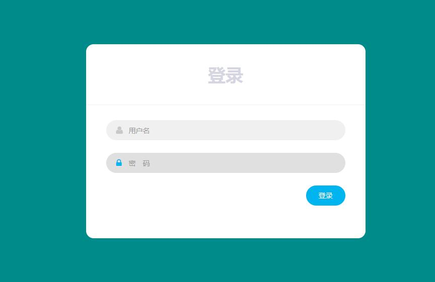
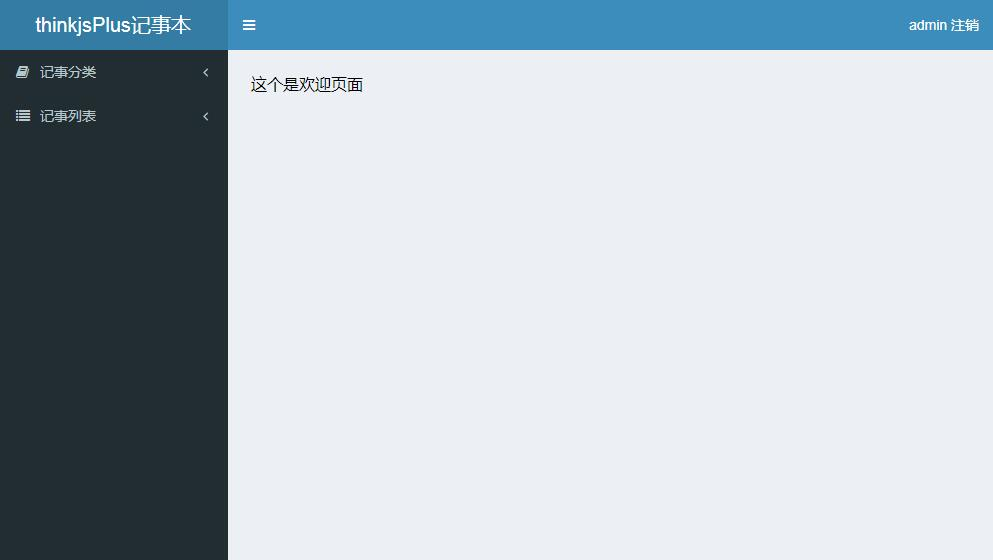
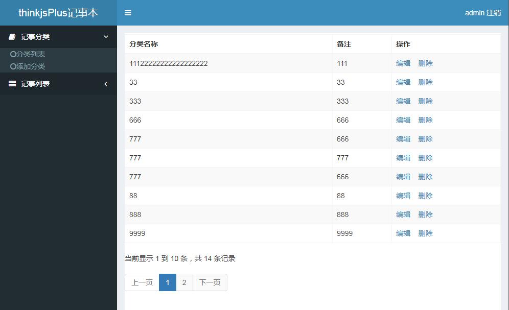
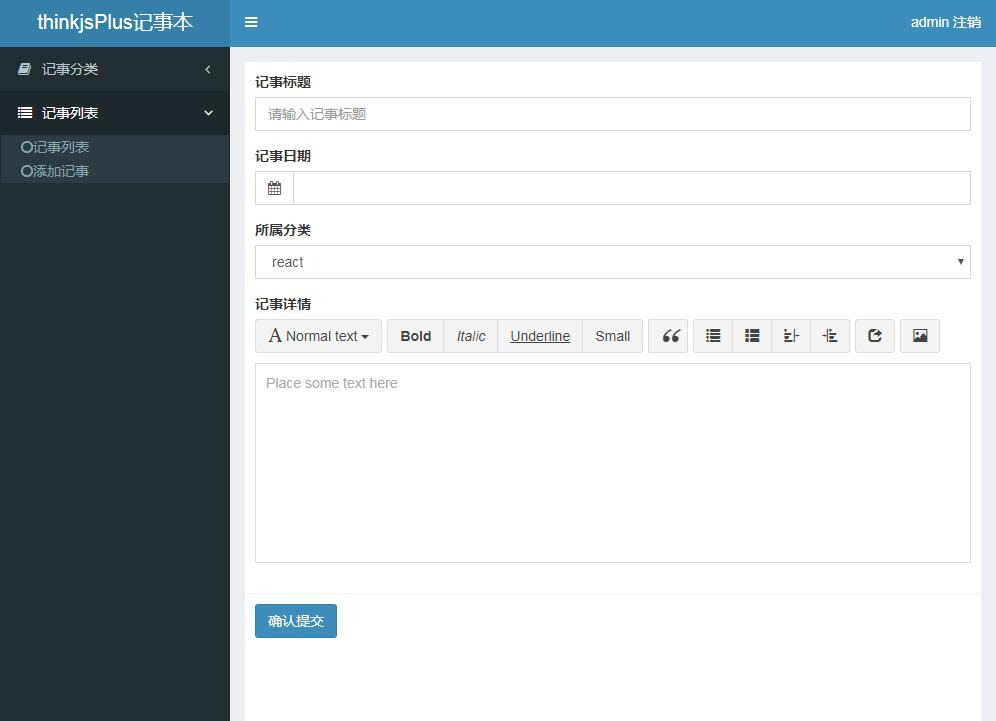
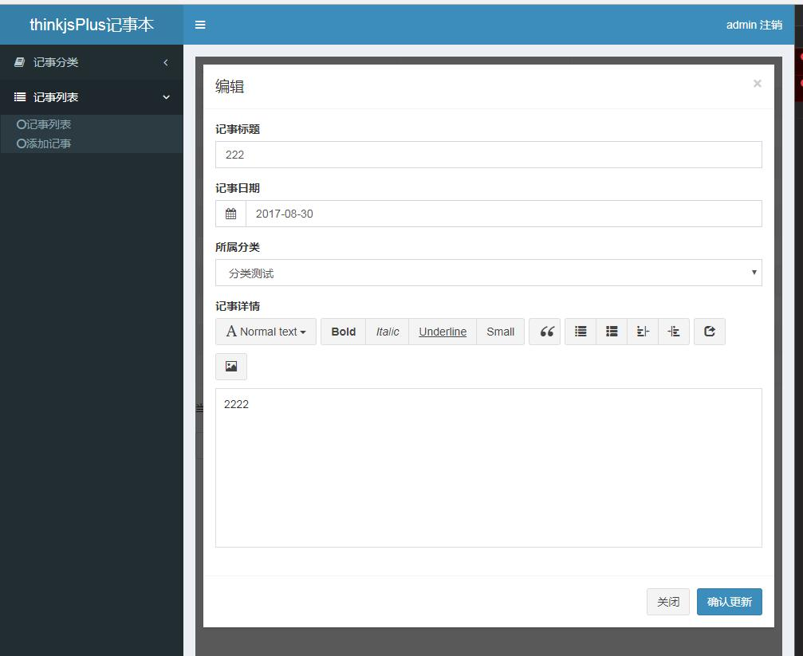

#### 1.安装 ThinkJS 命令
``` 
npm install -g think-cli
```
> 可以通过 thinkjs -v 查看 think-cli 的版本号，此版本号非 thinkjs 的版本号

#### 2.创建项目 thinkjsPlus
```
thinkjs new  thinkjsPlus
```
> 创建项目时可以指定 --mode=module 参数创建多模块项目(thinkjs new  thinkjsPlus --mode=module ),本项目没用此参数.
#### 3.项目结构
```
|--- development.js   //开发环境下的入口文件
|--- nginx.conf  //nginx 配置文件
|--- package.json
|--- pm2.json //pm2 配置文件
|--- production.js //生产环境下的入口文件
|--- README.md
|--- src
| |--- bootstrap  //启动自动执行目录 
| | |--- master.js //Master 进程下自动执行
| | |--- worker.js //Worker 进程下自动执行
| |--- config  //配置文件目录
| | |--- adapter.js  // adapter 配置文件 
| | |--- config.js  // 默认配置文件 
| | |--- config.production.js  //生产环境下的默认配置文件，和 config.js 合并 
| | |--- extend.js  //extend 配置文件 
| | |--- middleware.js //middleware 配置文件 
| | |--- router.js //自定义路由配置文件
| |--- controller  //控制器目录 
| | |--- base.js
| | |--- index.js
| |--- logic //logic 目录
| | |--- index.js
| |--- model //模型目录
| | |--- index.js
|--- view  //模板目录
| |--- index_index.html
|--- www
| |--- static  //静态资源目录
| | |--- css
| | |--- img
| | |--- js
```

#### 4. 项目服务启动
> 入口文件是 development.js，启动时直接和一般的node启动一样 node development.js即可。查看入口文件可知启动的时候，实际上是实例化 ThinkJS 里的 Application 类，执行 run 方法。

#### 5.配置数据库
> 本项目使用mysql数据库,配置文件的位置:src/config/adapter.js
```
exports.model = {
  type: 'mysql',
  common: {
    logConnect: isDev,
    logSql: isDev,
    logger: msg => think.logger.info(msg)
  },
  mysql: {
    handle: mysql,
    database: 'thinkjsplus',
    prefix: '',
    encoding: 'utf8',
    host: '127.0.0.1',
    port: '3306',
    user: 'root',
    password: 'root',
    dateStrings: true
  }
};
```
#### 5.1 创建模型文件
```
thinkjs model +模型文件名
```


#### 6. 控制器
>创建控制器的命令是 thinkjs controller +控制器名,我们创建admin后台登录控制器,同时在视图层我们创建admin控制器对应的html页面admin_index.html页面,启动服务,浏览器访问http://localhost:8360/admin就可以访问到admin_index.html的登录页面.
```
thinkjs controller admin
```

```
const user = this.model('thinkjsplus_user'); // controller 里实例化模型
const data = await user.select();
this.assign('title',data);
return this.display();
```

#### 7. 视图
>thinkjs3默认模板引擎是 nunjucks,如果在控制器action中这样写
```
this.assign('title',"测试网页之thinkjsplus!");
return this.display();
```
视图html页面中就可以这样写,拿到title
```
{{title}}
```
#### 8. 权限控制
> 权限代码如下:
```
module.exports = class extends think.Controller {
  async __before() {
    if(this.ctx.controller === 'admin' && this.ctx.action === 'index'||this.ctx.action === 'login' ){ //如果是admin_index那么久不验证了，直接返回给予登录。 
        return;   
    } 
    let userinfo =await this.session('userinfo')
    if (!think.isEmpty(userinfo)){  
      this.assign('userinfo',userinfo);  
    }else{  
      return this.redirect('/admin/index');  
    }  
  }
```
#### 9.本项目用到了mysql数据库,CRUD操作具体可以查看项目,本项目具有详细注释
```
/**
   * 保存分类
   */
  async saveAction() {
    let data = this.post();
    if (think.isEmpty(data.id)) {
      //保存
      let res = await this.model("thinkjsplus_category").add(data);
      if (res) {
        this.json({"succ":true});
      } else {
        this.json({"succ":false});
      }
    } else {
      //更新
      let res = await this.model("thinkjsplus_category").update(data);
      if (res) {
        this.json({"succ":true});
      } else {
        this.json({"succ":false});
      }
    }
  }
  /**
   * 删除分类
   */
  async delAction() {
    let categoryModel = this.model("thinkjsplus_category");
    let posts = this.post("id");
    let delNums = categoryModel.where({id: ['IN', posts]}).delete();
    if(delNums){
        this.json({"succ":true});
    }else{
        this.json({"succ":false});
    }
  }
  /**
   * 查看分类
   */
  async listAction() {
    const user = this.model('thinkjsplus_category'); // controller 里实例化模型
    const data = await user.select();
    return this.json(data);
  }
```
#### 10.运行本项目
> 首先安装mysql,之后导入项目sql文件夹,然后在项目根目录下运行 npm install,之后运行 npm start,即可启动本项目

#### 附项目截图




